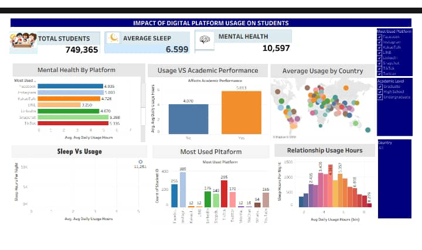

Impact of Digital Platform Usage on Students

 Project Overview

This project analyzes how students use digital platforms and examines how this usage affects their academic performance, sleep patterns, and mental health. With the increasing reliance on digital platforms, this analysis aims to uncover meaningful insights that can support better decision-making for students and educators.

---

 Dashboard Preview

---

Tools Used

- Tableau (Data Visualization)
- Microsoft Excel (Data Source & Cleaning)

---

 Dataset Description

The dataset contains information on student behavior and includes the following fields:

- Student ID
- Age
- Gender
- Academic Level
- Country
- Average Daily Usage Hours
- Most Used Platform
- Academic Performance Impact
- Sleep Hours Per Night
- Mental Health Score
- Overall Impact

---

 Key Insights

- Students spend a significant number of hours daily on digital platforms
- Higher digital usage is associated with negative academic performance
- Increased screen time is linked to reduced sleep duration
- Some platforms are associated with lower mental health scores
- Usage patterns vary across countries and academic levels

---

Dashboard Features

- Interactive filters (Country, Gender, Academic Level)
- KPI metrics (Total Students, Average Usage Hours, Average Sleep, Mental Health Score)
- Visualizations including bar charts, scatter plots, and maps
- Clean and user-friendly dashboard design

---

 Recommendations

- Students should manage and reduce excessive screen time
- Schools should promote awareness of healthy digital habits
- Encourage a balance between online and offline activities
- Improve sleep routines among students

---

Files Included

- Tableau Dashboard (.twbx)
- Dashboard Image Preview (PNG)
- README Documentation

---

 How to Use

1. Download the ".twbx" file from this repository
2. Open using Tableau Desktop
3. Explore the dashboard using the interactive filters

---

 Author

Ukatta Chinasa Rachael
